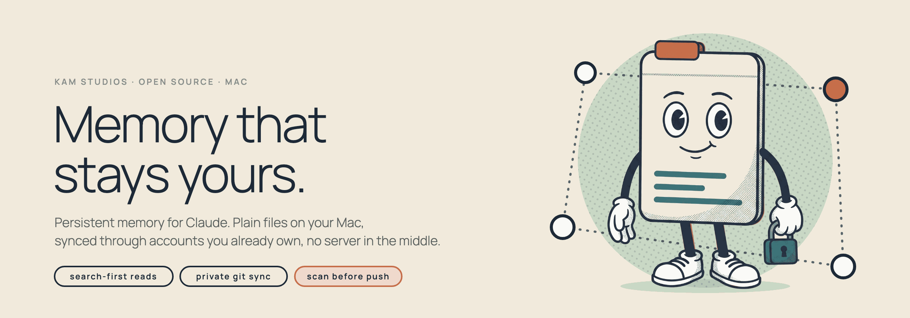
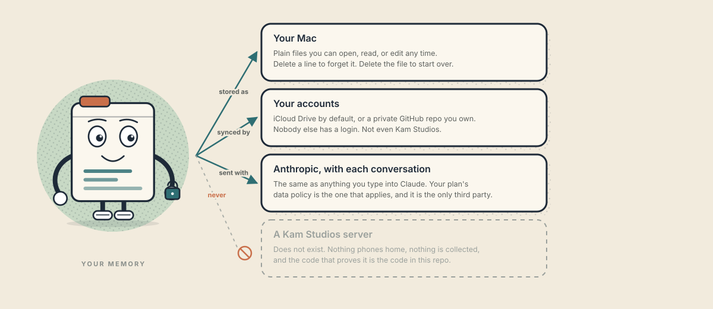
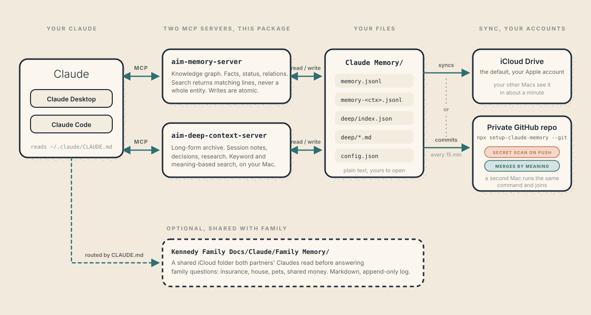

<picture>
  <source media="(prefers-color-scheme: dark)" srcset="docs/img/hero-dark.png">
  
</picture>

# setup-claude-memory

[](https://www.npmjs.com/package/setup-claude-memory)
[](LICENSE)
[](https://nodejs.org)


One command gives Claude a memory that survives the conversation. It lives in plain files on
your Mac, syncs through accounts you already own, and never touches a server of ours.

```bash
npx setup-claude-memory@latest
```

Not comfortable in Terminal? There is a [plain-language walkthrough](docs/GETTING-STARTED.md)
that explains every step.

---

## Where your data lives

<picture>
  <source media="(prefers-color-scheme: dark)" srcset="docs/img/where-your-data-lives-dark.svg">
  
</picture>

- **On your Mac, as plain text.** One folder, a few files, all readable in TextEdit. Delete a
  line and Claude forgets that one thing. Delete the folder and you start over.
- **In your accounts, nobody else's.** iCloud Drive by default. Or, with `--git`, a **private**
  GitHub repo created under your own login, where only you have access.
- **With Anthropic, per conversation.** When Claude uses your memory, the relevant lines travel
  with the chat, exactly like anything you type into Claude. Your plan's data policy applies.
  That is the only third party, and it is one you already chose.
- **Nowhere else.** No Kam Studios server. No analytics. No telemetry. The whole thing is a
  few files under [`bin/`](bin) and you can read them.

Before anything is ever pushed to GitHub, a scanner reads your memory for credentials. A
password, key, or token **blocks the push** until you remove it. Personal data such as phone
numbers, emails, and ids is reported but never blocks, because a memory of your own life
contains those, and the control for them is that the repo is private. Run it any time with
`--scan`.

---

## How it works

<picture>
  <source media="(prefers-color-scheme: dark)" srcset="docs/img/architecture-dark.svg">
  
</picture>

Two small servers ship in this package and register with Claude Desktop over
[MCP](https://modelcontextprotocol.io):

- **`aim-memory-server`** is the knowledge graph: facts, project status, who relates to what.
  It is search-first. A lookup returns the matching lines, never a whole entity, so memory stays
  fast no matter how much you accumulate. Writes are atomic (write a temp file, then rename), so
  an interrupted save can never leave your memory half-written.
- **`aim-deep-context-server`** is the long-form archive: session summaries, decisions, research.
  Keyword search and meaning-based search, with the embeddings computed on your Mac. No
  embedding API is called.

Both write to one folder. That folder is what syncs.

---

## Run it

**Requirements:** macOS with iCloud Drive on, [Claude Desktop](https://claude.ai/download), and
[Node.js 18+](https://nodejs.org) (`node --version` to check, `brew install node` to install).

```bash
npx setup-claude-memory@latest
```

Follow the prompts. Then:

1. Fully quit Claude Desktop (`Cmd+Q`, not just the window)
2. Relaunch it
3. Click `+` then **Connectors**. Your memory server is listed under your name, e.g. `Alex-Memory`

**Test it.** Tell Claude *"Remember that my name is [Name] and I work in [field]."* Open a new
chat and ask *"What do you know about me?"*

**Second Mac:** run the same command. Use the same folder name when prompted and your memory is
already there.

---

## Keep memory in git (v1.7.0+)

Memory can live in a private GitHub repo instead of a sync folder: versioned, reachable from
any machine, and safe for two people or two Macs to write at once.

```bash
npx setup-claude-memory@latest --git
```

It signs you in to GitHub in the browser, scans your memory for credentials, creates a
**private** repo, and syncs it every 15 minutes. You never type a git command, and your original
folder is renamed rather than deleted.

**Conflicts resolve themselves.** A semantic merge driver merges by meaning, entities by name and
observations as a proper three-way set, so two machines writing at the same time do not produce
a conflict to clear. Git's own options are both wrong here: its text merge leaves conflict markers
that make the file unparseable, and `merge=union` duplicates entity lines into a corrupt graph.

**Locations that sync are refused, not warned about.** iCloud corrupts git's internals and
Dropbox rewrites timestamps, both silently. `~/Documents` and `~/Desktop` are iCloud-backed
whenever "Desktop & Documents Folders" sync is on, which nothing in the path reveals, so the
installer probes for it rather than trusting the path.

### Adding another Mac

```bash
npx setup-claude-memory@latest --git
```

It notices the repo already exists and **joins** it. Cloning by hand is not enough: the merge
driver lives in `.git/config`, which a clone does not carry, so a hand-cloned Mac silently falls
back to git's text merge. The join step installs it, and reports anything that Mac had written
locally that never reached the repo.

### Check for credentials at any time

```bash
npx setup-claude-memory@latest --scan
```

### Archive finished work (v1.9.0+)

```bash
npx setup-claude-memory@latest --compact
```

Proposes finished status notes to move to an archive entity, grouped by why, approved by you.
**Nothing is ever deleted.** Archived observations stay searchable, and in git every pass is
revertable. Anything holding the last copy of an identifier is flagged and never bulk-approved.

---

## Family Memory (optional)

If you share an iCloud folder with a partner, the installer can deploy a **Family Memory**
template into `<shared folder>/Claude/Family Memory/` and add a routing block to
`~/.claude/CLAUDE.md`, so both of your Claudes consult the same shared facts (insurance, house,
pets, shared finances) before answering family questions.

```bash
npx setup-claude-memory@latest --family
```

The routing block is idempotent. Templates never clobber existing files, so your edits to
`FAMILY_MEMORY.md` and `facts.json` stick.

---

## Always use `@latest`

A bare `npx setup-claude-memory` records a `^X.Y.0` range the first time you run it and keeps
serving that cached copy for months. Someone whose cache was seeded in April silently re-ran a
four-month-old installer, which rewrote their config back to the old memory server and looked
like it had worked. `@latest` forces npm to check the registry.

---

## Search-first reads, the detail (v1.6.0+)

Once a project entity reaches a few hundred observations, a naive lookup returns the *whole*
entity and swallows the context window. `aim-memory-server` stops that:

- `aim_memory_search` returns the matching observations, not the whole entity, and reports how
  many matched versus how many it returned so the assistant knows when to narrow.
- `aim_memory_get` returns the 30 most recent observations by default and says how many older
  ones it withheld. `full: true` still loads everything when you mean it.
- Every response has a character budget. Over budget, the server returns fewer observations. It
  never cuts a response mid-JSON.

Measured against a real 981-observation entity: a search that previously returned about 809,000
characters now returns about 13,000.

It is a drop-in replacement for [`mcp-knowledge-graph`](https://github.com/shaneholloman/mcp-knowledge-graph)
(MIT): same tool names, same file format, same write semantics. Existing memory files work
unchanged, and upgrading is re-running the installer.

---

## Your memory file

```
~/Library/Mobile Documents/com~apple~CloudDocs/Claude Memory/memory.jsonl
```

Each line is one JSON object. Delete a line to remove that memory. With `--git`, the folder
moves outside iCloud and the installer tells you where.

---

## Troubleshooting

| Problem | Fix |
|---|---|
| Server not showing in Connectors | Fully quit Claude (`Cmd+Q`), not just close the window. Check the config for JSON errors at [jsonlint.com](https://jsonlint.com) |
| Memory not syncing to second Mac | Make sure iCloud Drive is on and signed in. Wait about a minute after writing. |
| `npx: command not found` | Install Node.js from [nodejs.org](https://nodejs.org) |
| First launch after an update says the server disconnected | Expected once: `@latest` is downloading the new version. Quit and reopen. |

---

Made by [Kam Studios](https://kamstudios.com). MIT licensed.
